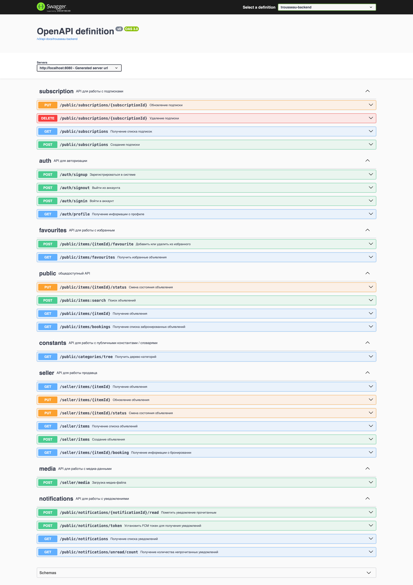

# ПРИДАНОЕ


Серверное приложение программного продукта "ПРИДАНОЕ". Мобильное приложение расположено в [другом репозитории](https://github.com/Andryss/Trousseau-mobile).

## Запуск

Для запуска приложения необходимо настроить и запустить СУБД [PostgreSQL](https://www.postgresql.org/) и S3-совместимое объектное хранилище (например, [MinIO](https://min.io/)).

Пример базовой настройки и запуска описанных компонентов в Docker-контейнерах описан в [docker-compose.yml](docker-compose.yml) файле. Компоненты могут быть подняты при помощи выполнения команды в корне репозитория:
```bash
docker compose up 
```

После настройки необходимых компонентов нужно заполнить файл [application.properties.example](src/main/resources/application.properties.example) и переименовать в `application.properties`.

Вариант 1. Запустить приложение при помощи команды:
```bash
./mvnw spring-boot:run
```

Вариант 2. Собрать jar-файл приложения при помощи команды:
```bash
./mvnw package
```

и запустить jar-файл при помощи команды:
```bash
java -jar target/Trousseau-0.0.1-SNAPSHOT.jar
```

## О приложении

Приложение создано при помощи [Spring Boot](https://spring.io/projects/spring-boot) и предоставляет HTTP REST API интерфейс, описанный в [trousseau.yaml](src/main/resources/api/trousseau.yaml).


