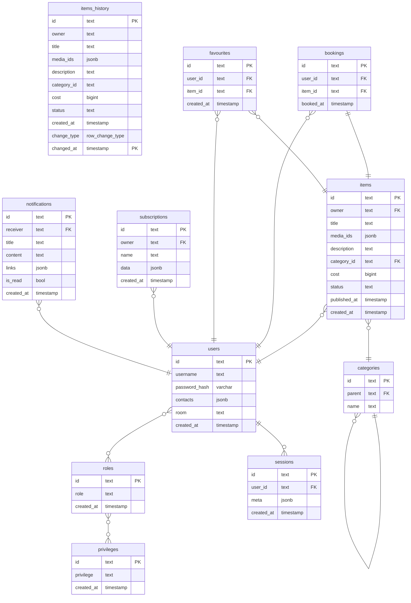

## Даталогическая модель базы данных

```mermaid
erDiagram
    users {
        id text PK
        username text
        password_hash varchar
        contacts jsonb
        room text
        created_at timestamp
    }
    roles {
        id text PK
        role text
        created_at timestamp
    }
    privileges {
        id text PK
        privilege text
        created_at timestamp
    }
    sessions {
        id text PK
        user_id text FK
        meta jsonb
        created_at timestamp
    }

    categories {
        id text PK
        parent text FK
        name text
    }

    items {
        id text PK
        owner text FK
        title text
        media_ids jsonb
        description text
        category_id text FK
        cost bigint
        status text
        published_at timestamp
        created_at timestamp
    }
    items_history {
        id text PK
        owner text
        title text
        media_ids jsonb
        description text
        category_id text
        cost bigint
        status text
        created_at timestamp
        change_type row_change_type
        changed_at timestamp PK
    }
    bookings {
        id text PK
        user_id text FK
        item_id text FK
        booked_at timestamp
    }
    favourites {
        id text PK
        user_id text FK
        item_id text FK
        created_at timestamp
    }
    subscriptions {
        id text PK
        owner text FK
        name text 
        data jsonb
        created_at timestamp
    }
    notifications {
        id text PK
        receiver text FK
        title text
        content text
        links jsonb 
        is_read bool
        created_at timestamp
    }

    users }o--o{ roles : ""
    roles }o--o{ privileges : ""
    users ||--o{ sessions : ""

    categories ||--o{ categories : ""
    
    items }o--|| users : ""
    items }o--|| categories : ""
    
    bookings }o--|| users : ""
    bookings ||--|| items : ""

    favourites }o--|| users : ""
    favourites }o--|| items : ""
    
    subscriptions }o--|| users : ""
    
    notifications }o--|| users : ""
```